## Title and Introduction

**Data Sets:**

The data set we have is provided by DataHack 2022 which describes
reviews given to products on Amazon. These reviews are either given by a
human or an AI (Chat GPT3 generated).
(<https://drive.google.com/file/d/1S8teNBz0I1eH6g3k4CIGi0Z06k0mxoMy/view?usp=sharing>)

**Observations:**

This dataset has 10000 entries, 5000 of which are AI-generated, and the
rest are Human Generated.

Row: Each row represents a given review.

Column: We have the following columns: reviewerId, ASIN, reviewerName,
helpful, reviewText, overall, summary, unixReviewTime, reviewTime, and
llm.

-   **reviewerId**: An unique ID given to the review.
-   **ASIN**: The product identification number which Amazon assigns.
-   **reviewerName**: Name of the reviewer.
-   **helpful**: Formatted as such: “\[x, y\]” where x is the number of
    helpful upvotes the review received and “y” is the number of total
    upvotes and downvotes the review received.
-   **reviewText**: The full review the reviewer wrote.
-   overall: The review value given to the product from the reviewer
    summary: The summary of the review given.
-   **unixReviewTime**: The time review was posted since January 1st,
    1970, at 00:00:00 UTC.
-   **reviewTime**: Human readable time the review is made.
-   **llm**: Boolean represents whether the review is AI-generated
    (True) or Human (False).

This dataset interests me because AI-generated reviews are a severe
problem in today’s world. I check the reviews before purchasing
products; if those reviews are fake, I will lose trust in companies such
as Amazon. Hence I am curious if this issue can be solved, which I plan
to explore using this dataset.

**How will I make this dataset usable and clean:**

Currently, the data I have is not directly usable without quantifying
it. I plan to make the following columns in the following process so
that I can use this dataset to explore the research question:

-   **grammar_score**: In order to get a grammar score I will use a
    python library called multiprocessing and language_tool_python, and
    then assign a score to the reviewText and import the dataset into
    R.  
-   **helpful_vote_reviews**/**total_vote_reveiws**: I will make two
    columns from helpful where **helpful_vote_reviews** = “X” and
    total_vote_reveiws = “Y”.
-   **Review_freq**: This is the number of reviews the reviewerId has
    made, this can be done using group_by and summarize with the
    TidyVerse library.
-   **mean_timing**: This represents the average time they take between
    multiple reviews posted by the same reviewerId. If there is only 1
    post, the default value is 0.
-   **llm_result**: This is the numeric value of the boolean value llm,
    done using tidyverse.
-   **length**: This represents the length of the reviewText, which I
    can get using tidyverse and the nchar function.

**Expectations:**

Given my changes, there will likely be a high correlation between
grammar_score and AI-generated reviews. To make it more human-like, the
AI would use lower-quality grammar; hence we should be able to see that
a lower grammar score will indicate AI.

Another trend I think we might see is that the review’s helpfulness will
tend to be near 0 for the AI since I think most humans only rate a
review if the review is personal and detailed, which the AI model may
not be able to generate.

The last trend I think we may notice is that the review length will be
shorter for AI since I think it’s attempting to show that the product is
good, but it would not be able to describe or share a personal anecdote
making the review shorter on average.

**Research Question**: Is it possible to distinguish between AI and
Human generated reviews? If so how good is the accuracy? What are some
other way Amazon can further improve this accuracy?

## Data Set Cleaning and Set Up:

Python Code to Assign Crammer Score:

``` r
 import pandas as pd
 from multiprocessing import Pool, cpu_count
 from language_tool_python import LanguageTool

# Load the dataset
 url = "Amazon_reviews_plus_LLM.csv"
 data = pd.read_csv(url)

# Trims the dataset to have a balanced dataset 
 df_false = data[data['llm'] == False].sample(n=5000)
 df_true = data[data['llm'] == True].sample(n=5000)
 data = pd.concat([df_false, df_true])

# Initialize LanguageTool with default language (English)
 tool = LanguageTool('en-US')

# Define a function to check grammar for a given text
 def get_grammar_score(text):
    matches = tool.check(text)
    return len(matches)

# Use multiprocessing to parallelize the grammar checking process
 with Pool(processes=cpu_count()) as pool:
    grammar_scores = pool.map(get_grammar_score, data['reviewText'])

# Add the grammar scores as a new column in the dataset
 data['grammar_score'] = grammar_scores


# Display first few rows of the dataset
 data.head()
```

### a. Import Data Set with Grammar

``` r
# Impports Data Set 
reviews <- read_csv("Amazon_reviews_plus_LLM_with_grammar_scores.csv")

# Displays Part of the DataSet 
head(reviews)
```

    ## # A tibble: 6 × 11
    ##   reviewerID asin  revie…¹ helpful revie…² overall summary unixR…³ revie…⁴ llm  
    ##   <chr>      <chr> <chr>   <chr>   <chr>     <dbl> <chr>     <dbl> <chr>   <lgl>
    ## 1 acde75b2-… 235e… S. Bohn [0, 0]  It has…       5 I love…  1.37e9 05 1, … FALSE
    ## 2 92c283f1-… 7c34… L. Haw… [0, 0]  These …       4 work m…  1.40e9 04 18,… FALSE
    ## 3 ee564575-… ce51… Antigo… [0, 0]  Patien…       3 Color …  1.40e9 05 20,… FALSE
    ## 4 115d1af4-… d0e6… Zombie… [0, 0]  This w…       1 Didn't…  1.37e9 05 3, … FALSE
    ## 5 219de8a5-… ac5e… Cute C… [0, 0]  This s…       4 Great …  1.40e9 06 27,… FALSE
    ## 6 c74a551f-… d998… Steven… [2, 2]  I am u…       5 My Fav…  1.38e9 08 20,… FALSE
    ## # … with 1 more variable: grammar_score <dbl>, and abbreviated variable names
    ## #   ¹​reviewerName, ²​reviewText, ³​unixReviewTime, ⁴​reviewTime

### b. Cleaning and Mutating

``` r
# Get the number of reviews the reviewer has made 
reviews_num_reviews <- reviews %>% 
  group_by(reviewerID) %>% 
  summarize(review_freq = n())

# Combines the datasets to add the number of reviews the reviewer has made to the orgial dataset 
reviews <- left_join(reviews, reviews_num_reviews, by = "reviewerID")

# Finds the average time the reviewer takes between makinf reviews 
reviews_mean_timing <- reviews %>% 
  group_by(reviewerID) %>% 
  arrange(unixReviewTime) %>% # Sorting to find average in an accending order 
  summarize(mean_timing = ifelse(review_freq > 1, mean(diff(as.POSIXct(unixReviewTime, origin = "1970-01-01", tz = "UTC")
), na.rm = TRUE), 0))

# Joining the datasets so we can add the mean_timing to the orginal dataset 
reviews_mean_timing <- inner_join(reviews, reviews_mean_timing, by = "reviewerID") 

# Droping all duplicate rows 
reviews <- distinct(reviews_mean_timing)

# Spliting the helful [x, y] -> helpful_vote_reviews = x and total_vote_reviews = y 
reviews <- reviews %>% 
  extract(helpful, c("helpful_vote_reviews", "total_vote_reviews"), "\\[(\\d+), (\\d+)\\]", convert = TRUE)

# Making a numerical representation of the boolean llm 
reviews <- reviews %>% mutate(llm_result = ifelse(llm == FALSE, 0, 1)) 

# Adds the length of the review as a column to the dataset 
reviews <- reviews %>% mutate(length = nchar(reviewText))

# Displays the new modifed  dataset 
head(reviews)
```

    ## # A tibble: 6 × 16
    ##   review…¹ asin  revie…² helpf…³ total…⁴ revie…⁵ overall summary unixR…⁶ revie…⁷
    ##   <chr>    <chr> <chr>     <int>   <int> <chr>     <dbl> <chr>     <dbl> <chr>  
    ## 1 acde75b… 235e… S. Bohn       0       0 It has…       5 I love…  1.37e9 05 1, …
    ## 2 92c283f… 7c34… L. Haw…       0       0 These …       4 work m…  1.40e9 04 18,…
    ## 3 ee56457… ce51… Antigo…       0       0 Patien…       3 Color …  1.40e9 05 20,…
    ## 4 115d1af… d0e6… Zombie…       0       0 This w…       1 Didn't…  1.37e9 05 3, …
    ## 5 219de8a… ac5e… Cute C…       0       0 This s…       4 Great …  1.40e9 06 27,…
    ## 6 c74a551… d998… Steven…       2       2 I am u…       5 My Fav…  1.38e9 08 20,…
    ## # … with 6 more variables: llm <lgl>, grammar_score <dbl>, review_freq <int>,
    ## #   mean_timing <dbl>, llm_result <dbl>, length <int>, and abbreviated variable
    ## #   names ¹​reviewerID, ²​reviewerName, ³​helpful_vote_reviews,
    ## #   ⁴​total_vote_reviews, ⁵​reviewText, ⁶​unixReviewTime, ⁷​reviewTime

## Exploratory Data Analysis:

Correlation Matrix:

``` r
# Makes a Correlation Matrix 
ggcorrplot(cor(reviews %>% select_if(is.numeric)),
           type = "upper", # upper diagonal
           lab = TRUE, # print values
           method = "circle") # use circles with different sizes
```

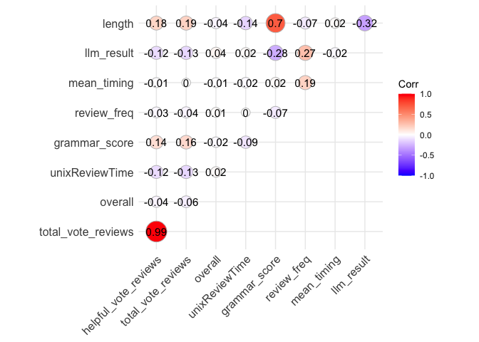

Looking at the Correlation Matrix we can see that here is a high
correlation between helpful_vote_reviews and total_vote_reviews with a
value of .99. This makes sense the higher number helpful_vote_reviews
the higher the number of total_vote_reviews. An interesting correlation
can be seen between grammar_score and length of the review with the
value of .7. This makes sense since the longer the sentence the higher
the chance that the grammar is formal, instead of “its great” the longer
reviews would be “This product is amazing!” We see that review_freq and
unixReviewTime have no correlation. This makes since the frequency of
someone posting a review has no logical connection with the time they
post it.

Now lets explore the data sets:

``` r
# Makes a box_plot for the grammer scores given its AI or Human 
reviews %>% 
  ggplot(aes(grammar_score, group = llm)) + 
  geom_boxplot(aes(fill = llm)) +
  labs(x = "Grammer Score", title = "Box Plot for the Grammer Scores", color = "LLM")
```

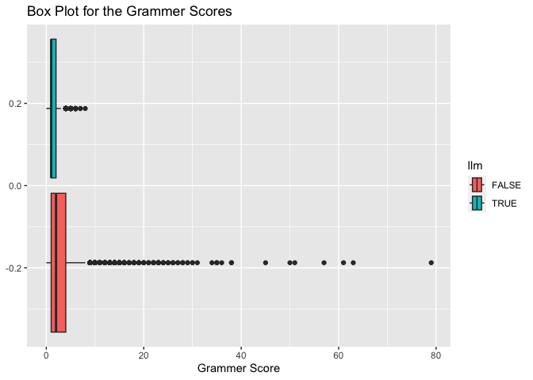

``` r
# Makes a close up of the box_plot above 
reviews %>% 
  filter(grammar_score < 20) %>% 
  ggplot(aes(grammar_score, group = llm)) + 
  geom_boxplot(aes(fill = llm)) +
  labs(x = "Grammer Score", title = "Close Up - Box Plot for the Grammer Scores", color = "LLM")
```

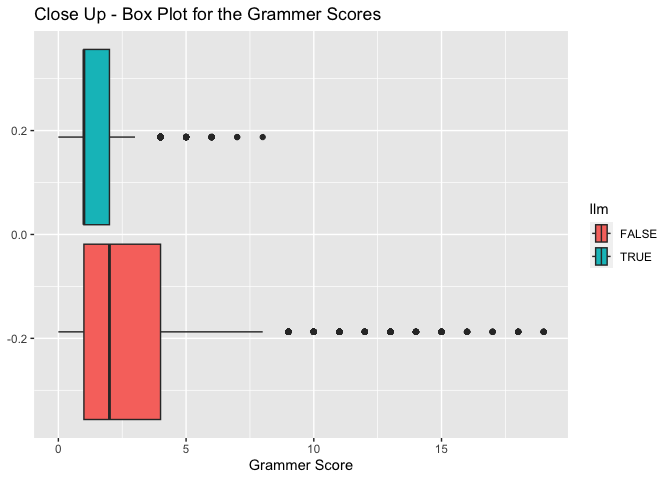

In this box plot we can see that that the humans tend to have a higher
grammar score compared to the AI generated ones. This could be a good
predictor to use to see if the review is AI generated or Human
generated. We can also see that the range for the Human generated
reviews is much higher than the AI generated ones. Also as to what I
predicted the grammar score for the AI generated reviews is low in
general. We can also see that the upper qaurtile value of the Grammar is
the mean for the Humans which indictaes this is a good predictor. Also
we can see in the close up version that the difference between the two
is significant enough to be used a predictor, as its clear the AI model
has a lower range of values within its IQR.

``` r
# Makes a box_plot for the average time reviewers take between posts 
reviews %>% 
  filter(mean_timing != 0) %>% 
  ggplot(aes(mean_timing, group = llm)) + 
  geom_boxplot(aes(fill = llm)) +
  labs(x = "Average Time Between Posts (secs)", title = "Box Plot for the Average Time Between Posts", color = "LLM")
```

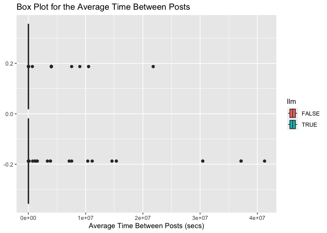

``` r
# Makes a box_plot for the average time reviewers take between posts removing some of 
# the outliers 
reviews %>% 
  filter(mean_timing != 0 & mean_timing < 10000) %>% 
  ggplot(aes(mean_timing, group = llm)) + 
  geom_boxplot(aes(fill = llm)) +
  labs(x = "Average Time Between Posts (secs)", title = "Box Plot for the Average Time Between Posts", color = "LLM")
```

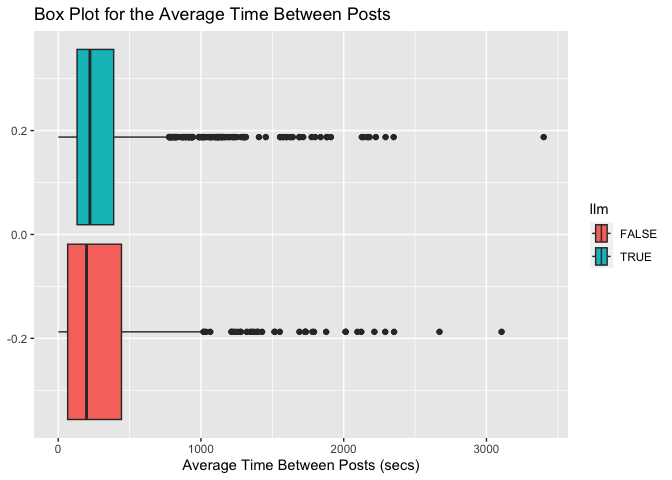

In this box plot we can see that that the humans tend to have much
higher valued outliers. Looking at the close up version we can say that
this is not a good predictor since the mean seems to be the same between
the AI and Human generated reviews. This goes against my expectation, I
thought that the AI would post more frequently than Human at a faster
pace. This however makes sense since if the AI posted too much too fast
the companies such as Amazon would easily be able to pick up on them. We
can still use this as a predictor, but it won’t be a good predictor
which provides much insight.

``` r
# Makes a box_plot for the overall review the reviews give 
reviews %>% 
  ggplot(aes(overall, group = llm)) + 
  geom_boxplot(aes(fill = llm)) +
  labs(x = "Score Given By Reviewer", title = "Box Plot for the Score Given By Reviewer", color = "LLM")
```

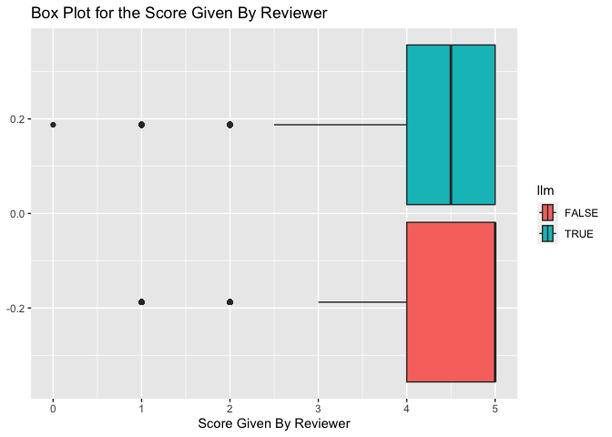

In this box plot we can see that that the humans on average give a
rating of 5. This would also be not a good (\~ok predictor) predictor
since both Humans and AI tend to give a score between 4 and 5, and the
means are close for them: AI is 4.5 on average and Humans are 5. One
interesting thing that we can see is that the AI tends to give a higher
range of values, and I wonder if this is to seem “Human Like” ? This can
still be used a predictor as a tipping point, however the insight this
provides is little. However Amazon could preform a further analysis to
see if there is a pattern in which a reviewer gives a review, or if the
overall review they gave seems to be a random number? Perhaps that would
give more insight.

``` r
# Makes a box_plot for the Number of Posted Reviews For the Reviewer
reviews %>% 
  ggplot(aes(review_freq, group = llm)) + 
  geom_boxplot(aes(fill = llm)) +
  labs(x = "Number of Posted Reviews For the Reviewer", title = "Box Plot for the Number of Posted Reviews For the Reviewer", color = "LLM")
```

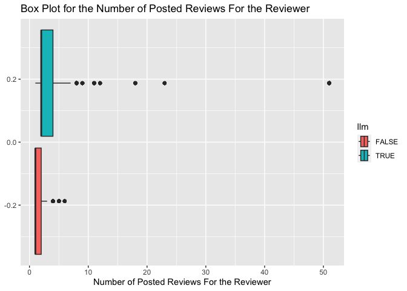

``` r
# Makes a box_plot for the Number of Posted Reviews For the Reviewer - Close Up Version 
reviews %>% 
  filter(review_freq < 15) %>% 
  ggplot(aes(review_freq, group = llm)) + 
  geom_boxplot(aes(fill = llm)) +
  labs(x = "Number of Posted Reviews For the Reviewer", title = "Close Up Version: Box Plot for the Number of Posted Reviews For the Reviewer", color = "LLM")
```

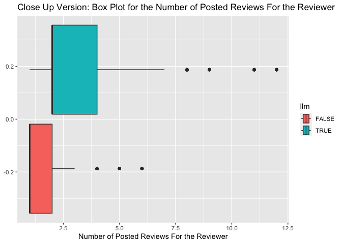

In this box plot we can see that the AI tends to have a higher number of
reviews posted, and more outliers than the Humans. In the close up
version we can see that the upper quartile for the humans is the mean
and lower quartile for the AI. This means that this is a good predictor
and the higher the number of posts made by a review the higher the
chance the review is AI generated. Also it seem that on average the
human makes only 1 post, which makes sense since as humans we don’t
regularly post a review instead we tend to tell our friends and family.
Also we can see that the range of number of reviews posted is higher for
the AI model compared to Humans. Overall, we should use this as a
predictor in our model when predicting.

``` r
# Makes a box_plot for the Length of the Review 
reviews %>% 
  ggplot(aes(length, group = llm)) + 
  geom_boxplot(aes(fill = llm)) +
  labs(x = "Length of Reviews", title = "Box Plot for the Length of Reviews", color = "LLM")
```

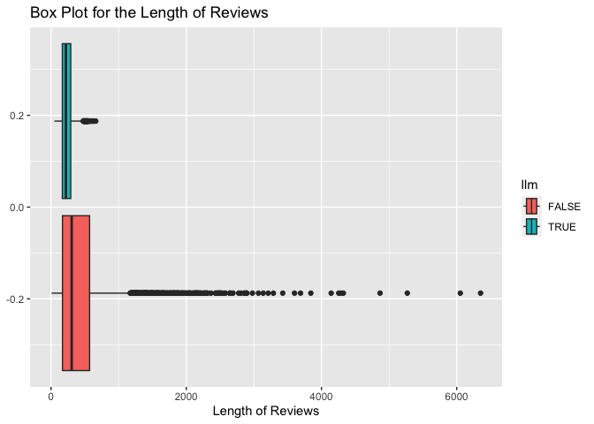

``` r
# Makes a box_plot for the Length of the Review - Close Up Version 
reviews %>% 
  filter(length < 1500) %>% # Takes away the upper values to make a close up 
  ggplot(aes(length, group = llm)) + 
  geom_boxplot(aes(fill = llm)) +
  labs(x = "Length of Reviews", title = "Close Up Version: Box Plot for the Length of Reviews", color = "LLM")
```

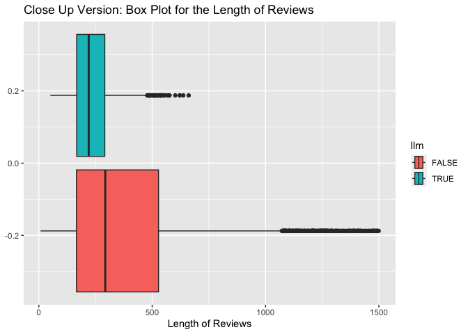

In this box plot we can see that Humans tend to post longer reviews than
AI models. In fact we can see that the upper quartile of the length of
review for the AI model is the mean of the Humans. Also Humans tend to
have a high number of outliers, and a much higher range of values
compared to the AI model. This matches the expectation I mentioned
before, and furthermore validates the idea that humans have longer
responses since they tend to express emotion through an personal
experience and the AI is often incapable of this. Overall, this is a
great predictor and we can use this when making a prediction model.

## Prediction and Cross-Validation:

I will use the three predictors mentioned (as good predictors) above:
grammar_score, overall, review_freq, and length.

Makes the prediction model:

``` r
# Prediction Model to detect AI using k-Nearest Neighbor (looks at closest 5)
reviews_knn <- knn3(llm ~ grammar_score + overall + review_freq + length,
                data = reviews, 
                k = 5)

# Makes a prediction on the whole data set 
predict(reviews_knn, reviews) %>% as.data.frame %>% head
```

    ##       FALSE      TRUE
    ## 1 0.5000000 0.5000000
    ## 2 0.1428571 0.8571429
    ## 3 1.0000000 0.0000000
    ## 4 0.6000000 0.4000000
    ## 5 1.0000000 0.0000000
    ## 6 1.0000000 0.0000000

Makes the ROC curve:

``` r
# Build new ROC curve using the knn model 
ROC <- ggplot(reviews) + 
  geom_roc(aes(d = llm_result, m = predict(reviews_knn, reviews)[,2]), n.cuts = 10)

# Displays the curve 
ROC 
```

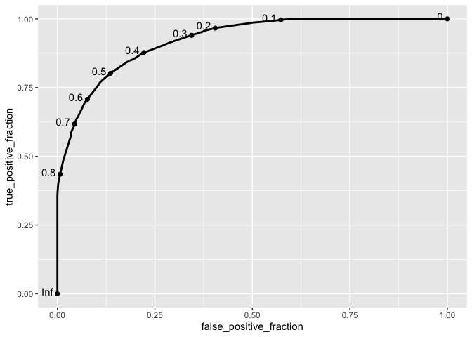

``` r
# Calculates the value of AUC and displays it 
calc_auc(ROC)
```

    ##   PANEL group       AUC
    ## 1     1    -1 0.9229676

The AUC value is seen to be .923 which is a very good AUC value showing
that this model preforms well for this dataset.

10 Fold Cross Validation:

``` r
# 10 fold - Cross validation for the kNN model
kNN_cv <- train(as.factor(llm) ~ grammar_score + overall + review_freq + length,
      data = reviews,
      method = "knn",
      trControl = trainControl(method = "cv", number = 10)) # 10-fold cv

# Displays the summary/results 
kNN_cv
```

    ## k-Nearest Neighbors 
    ## 
    ## 10000 samples
    ##     4 predictor
    ##     2 classes: 'FALSE', 'TRUE' 
    ## 
    ## No pre-processing
    ## Resampling: Cross-Validated (10 fold) 
    ## Summary of sample sizes: 9000, 9000, 9000, 9000, 9000, 9000, ... 
    ## Resampling results across tuning parameters:
    ## 
    ##   k  Accuracy  Kappa 
    ##   5  0.7740    0.5480
    ##   7  0.7712    0.5424
    ##   9  0.7703    0.5406
    ## 
    ## Accuracy was used to select the optimal model using the largest value.
    ## The final value used for the model was k = 5.

We can see that for the knn with 5 neighbors we get an average accuracy
of .7711 which mean that on average we can get 77% accuracy when
bringing in new data.

Our model with new data tends to do more than 50% accuracy making it a
better than random model for predicting AI versus Human reviews. We can
see that the AUC value was .9229 which means this model is excellent
when its predicting values given the whole dataset, but not as good when
new data is introduced. This indicates that there is some over fitting
occurring and this could be fixed by giving it more data as the dataset
would be more diluted. The data set has 204k rows, however to balance
the dataset I chose 5k AI and 5k human, but if we wanted to give it more
data it is possible. Also this means we can also use more neighbors,
perhaps 7 might be a better choice. However, overall the model is works
well even when new data is introduced.

## Dimensionality Reduction:

PCA analysis:

``` r
# Making the data only numeric and scaling it 
reviews_num <- reviews %>%
   select_if(is.numeric) %>%
   scale

# performing PCA 
reviews_pca <- reviews_num %>% prcomp

# New perspective on our data
reviews_pca$x %>% as.data.frame
```

    ##            PC1          PC2         PC3        PC4        PC5        PC6
    ## 1  -0.16617624 -0.207061019 -0.69590416 -0.5043719  0.4652618 -0.8033418
    ## 2  -0.44094285  0.026771361 -0.76533359  0.5602442  0.8874655 -0.3269072
    ## 3   2.93467465 -3.371126849  1.28204568  0.8713164  0.5944425  1.9961992
    ## 4  -0.04109365 -0.003809805 -0.55396487  3.1425538 -0.5335116 -0.1487055
    ## 5   0.83426317 -1.301389750  0.04633326  0.3459635  0.9761151  0.5917479
    ## 6   1.57700379 -1.561258029  0.20041805 -0.7700240  0.7150499  0.3636462
    ## 7   0.45475879  0.039449466 -0.67948997 -0.5276132  0.6447950 -0.6312864
    ## 8  -0.20073692 -0.223761147 -0.72926903 -0.4757361  0.6475168 -0.6966271
    ## 9   1.41835090 -1.527139140  0.23112364  1.1869107  0.6565203  0.9030498
    ## 10 -0.06553966 -0.338445106 -0.73276171  0.4809497  0.6817991 -0.3338821
    ## 11 -0.29188875  0.054119920 -0.65554670  1.3771807  0.1744212 -0.4072224
    ##            PC7         PC8          PC9
    ## 1  -0.61594066 -0.01768498 -0.012201281
    ## 2  -0.76918986  0.10858998 -0.016072445
    ## 3   0.09020669  1.36051719 -0.056812842
    ## 4  -0.77684154  0.16324911 -0.056554524
    ## 5  -0.46430315  0.74340858 -0.027187674
    ## 6  -0.14902407 -0.61814537 -0.036542945
    ## 7  -0.54047566  0.28635625  0.049180843
    ## 8  -0.58056559 -0.41100549 -0.009215338
    ## 9  -0.37514175  1.75824257 -0.053491657
    ## 10 -0.53252430  0.21366642 -0.020575408
    ## 11 -0.80033181  0.06047160 -0.031399612
    ##  [ reached 'max' / getOption("max.print") -- omitted 9989 rows ]

``` r
# Visualize percentage of variance explained for each PC in a scree plot
fviz_eig(reviews_pca, addlabels = TRUE, ylim = c(0, 90))
```

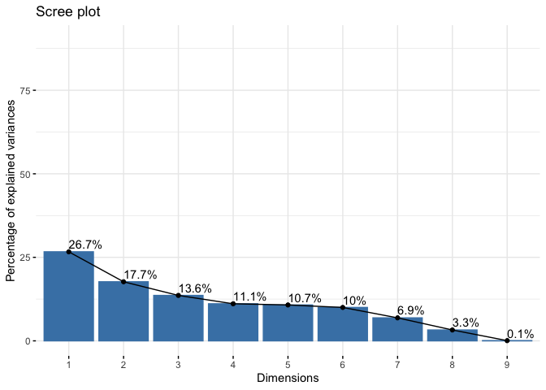

We can see in the scree plot that to Dim 1 explain 26.7% variance and
Dim 2 explains 17.7% variance. Overall the first 2 Dimensions explain
44.4% of the variance. In order to explain \~80% it would make sense to
keep the first five Dimensions.

``` r
# Write code here
fviz_pca_ind(reviews_pca,
             col.ind = reviews$llm,
             repel = FALSE)
```

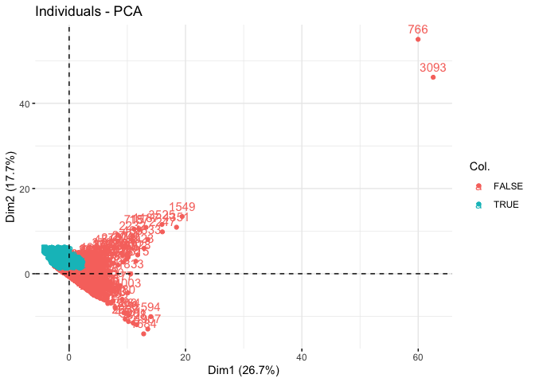

``` r
# Plot the first two principal components (filtering outliers for a close up)
pc_scores <- as.data.frame(reviews_pca$x)
pc_scores %>% 
  filter(PC1 < 40) %>% 
  ggplot(aes(x = PC1, y = PC2)) +
  geom_point() +
  labs(title = "PCA", x = "Dim 1: 26.7%", y = "Dim 2: 17.7%")
```

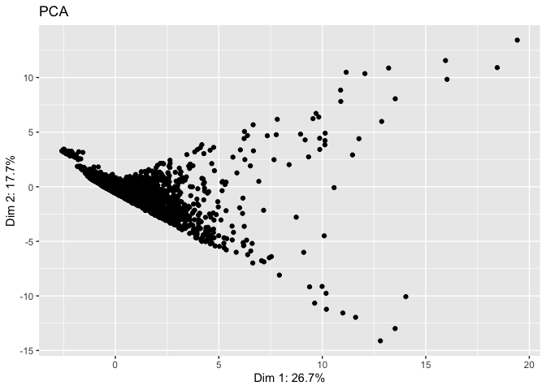

``` r
# Makes a correlation circle 
fviz_pca_var(reviews_pca, col.var = "black", 
             repel = TRUE)
```

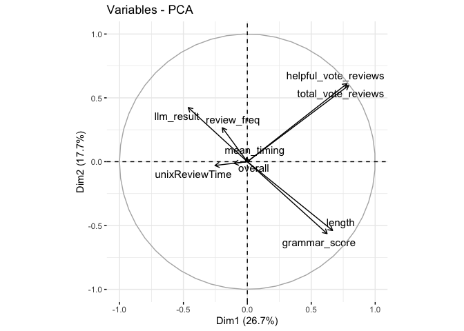

We can see that these PCs explain 44.4% of the variance in our dataset.
We can see in out correlation circle that helpful_vote_reviews and
total_vote_reviews are highly correlation as well as length and
grammar_score. Mean timing and unixReviewTime are at \~90 degrees making
them have no correlation. Based on the PCA graph we can see that a
high/positive value on dimension 1 tends to mean you are a human review,
and a negative/low value on Dimension 1 means that the review is AI
generated. On Dimension 2 we can see that a positive value indicates
both AI and Human (but positive Dim 1 and Dim 2 indicates mostly Human
and negative Dim 1 and positive Dim 2 indicates AI). We also see a
negative Dim 2 value indicates human generated. Also we can see that the
data points which has a positive Dim1 means that they have a high value
for length, grammar_score, total_vote_reviews, and helpful_vote_reviews.
Also the data points which have a negative value for Dim 1 means its
related to review_freq, llm_results, and unixReviewText. When it comes
Dim2 the positive value indicates that there is a high value for
total_vote_reviews, helpful_vote_reviews, review_freq, and llm_result,
and a negative value indicates grammer_score, length, and
unixReviewTIme.

## Clustering:

``` r
# Inorder to save time takes a random sample of 2000 from the 10k dataset 
sampled_data <- reviews_num[sample(1:nrow(reviews_num), 2000), ]

# Gets the number of clusters it should make based on silhouette width  
fviz_nbclust(sampled_data, pam, method = "silhouette")
```

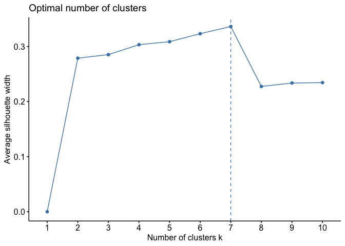

We see that the it should make 6 clusters based on silhouette width,
however since we only have two groups of either AI generated or Human
generated reviews, we should use 2 as the number of groups. We can also
see that 2 groups is similar to 6 groups from the graph above making it
reasonable to use 2 groups.

PAM Clustering:

``` r
# for reproduction
set.seed(123)

# Use the function pam() to find clusters
pam_results <- reviews_num %>%
  pam(k = 2) # k is the number of clusters

# Take a look at the resulting object
pam_results
```

    ## Medoids:
    ##        ID helpful_vote_reviews total_vote_reviews    overall unixReviewTime
    ## [1,] 2377           0.02057527       -0.009913866 -0.2014448      0.2077173
    ## [2,] 8586          -0.11550455       -0.133528160  0.2780486      0.2481917
    ##      grammar_score review_freq mean_timing llm_result     length
    ## [1,]    -0.1062132  -0.3680560 -0.07849342   -0.99995 -0.1013502
    ## [2,]    -0.3997821   0.1273087 -0.07848519    0.99995 -0.2066190
    ## Clustering vector:
    ##   [1] 1 1 1 1 1 1 1 1 1 1 1 1 1 1 1 1 1 1 1 1 1 1 1 1 1 1 1 1 1 1 1 1 1 1 1 1 1
    ##  [38] 1 1 1 1 1 1 1 1 1 1 1 1 1 1 1 1 1 1 1 1 1 1 1 1 1 1 1 1 1 1 1 1 1 1 1 1 1
    ##  [75] 1 1 1 1 1 1 1 1 1 1 1 1 1 1 1 1 1 1 1 1 1 1 1 1 1 1
    ##  [ reached getOption("max.print") -- omitted 9900 entries ]
    ## Objective function:
    ##    build     swap 
    ## 1.803218 1.797666 
    ## 
    ## Available components:
    ##  [1] "medoids"    "id.med"     "clustering" "objective"  "isolation" 
    ##  [6] "clusinfo"   "silinfo"    "diss"       "call"       "data"

2-Dimension Plot:

``` r
# Converts clustring results into a factor 
cluster_labels <- as.factor(pam_results$clustering)

# Makes the PCA scores into a dataframe 
x <- as.data.frame(reviews_pca$x)

# Adds the clustring results into the dataframe 
x$cluster <- cluster_labels

# Add llm information to the principal component scores
x$llm <- as.factor(reviews$llm)

x$reviewerID <- reviews$reviewerID


# Plot the results
x %>%
  ggplot(aes(x = PC1, y = PC2, color = cluster, shape = llm)) +
  geom_point() +
  labs(title = "PCA",
       x = "DM 1 (26.7%)",
       y = "DM 2 (17.7%)",
       color = "Cluster", 
       shape = "LLM")
```

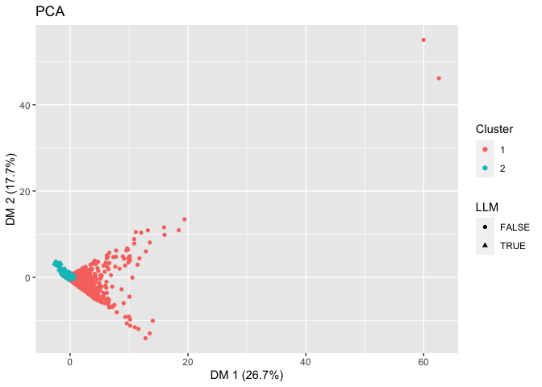

``` r
# Plot the results (Close Up)
x %>%
  filter(PC1 < 5) %>% # Helps filter outliers to get a closer look 
  ggplot(aes(x = PC1, y = PC2, color = cluster, shape = llm)) +
  geom_point() +
  labs(title = "PCA - Close Up",
       x = "DM 1 (26.7%)",
       y = "DM 2 (17.7%)",
       color = "Cluster" ,
       shape = "LLM")
```

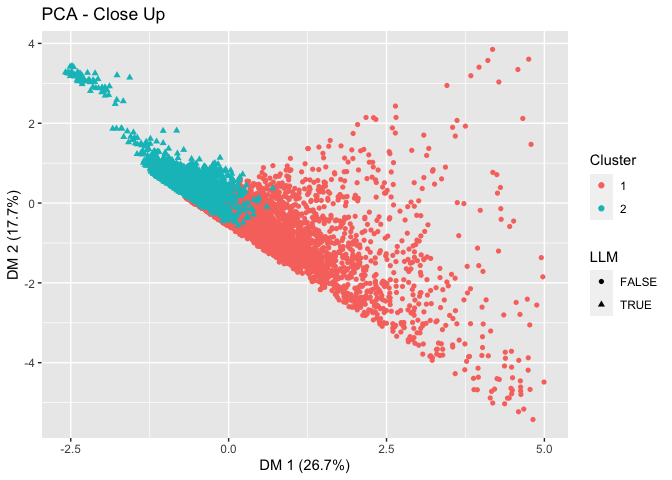

``` r
# Same Grpahs as above 
# Much smaller dataset 
# Done to see if the red points are mostly Human or not 

set.seed(123)  # set seed to 123

# Random Sampling 
x_true <- x %>%
  filter(llm == TRUE) %>%
  sample_n(25)

x_false <- x %>%
  filter(llm == FALSE) %>%
  sample_n(25)

# PCA graph like above 
ggplot() +
  geom_point(data = x_true, aes(x = PC1, y = PC2, color = cluster, shape = llm)) +
  geom_point(data = x_false, aes(x = PC1, y = PC2, color = cluster, shape = llm)) +
  labs(title = "PCA - Close Up - 50 Observations",
       x = "DM 1 (26.7%)",
       y = "DM 2 (17.7%)",
       color = "Cluster",
       shape = "LLM")
```

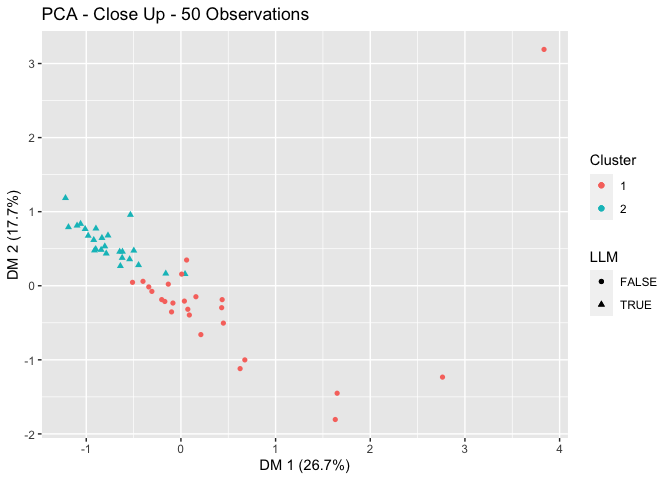

``` r
# Displays the PAM Results:
pam_results
```

    ## Medoids:
    ##        ID helpful_vote_reviews total_vote_reviews    overall unixReviewTime
    ## [1,] 2377           0.02057527       -0.009913866 -0.2014448      0.2077173
    ## [2,] 8586          -0.11550455       -0.133528160  0.2780486      0.2481917
    ##      grammar_score review_freq mean_timing llm_result     length
    ## [1,]    -0.1062132  -0.3680560 -0.07849342   -0.99995 -0.1013502
    ## [2,]    -0.3997821   0.1273087 -0.07848519    0.99995 -0.2066190
    ## Clustering vector:
    ##   [1] 1 1 1 1 1 1 1 1 1 1 1 1 1 1 1 1 1 1 1 1 1 1 1 1 1 1 1 1 1 1 1 1 1 1 1 1 1
    ##  [38] 1 1 1 1 1 1 1 1 1 1 1 1 1 1 1 1 1 1 1 1 1 1 1 1 1 1 1 1 1 1 1 1 1 1 1 1 1
    ##  [75] 1 1 1 1 1 1 1 1 1 1 1 1 1 1 1 1 1 1 1 1 1 1 1 1 1 1
    ##  [ reached getOption("max.print") -- omitted 9900 entries ]
    ## Objective function:
    ##    build     swap 
    ## 1.803218 1.797666 
    ## 
    ## Available components:
    ##  [1] "medoids"    "id.med"     "clustering" "objective"  "isolation" 
    ##  [6] "clusinfo"   "silinfo"    "diss"       "call"       "data"

``` r
# Number of cluster 
length(unique(pam_results$clustering))
```

    ## [1] 2

``` r
# Sizes of the clusters
table(pam_results$clustering)
```

    ## 
    ##    1    2 
    ## 5000 5000

``` r
# the medoids - centers 
pam_results$medoids
```

    ##      helpful_vote_reviews total_vote_reviews    overall unixReviewTime
    ## [1,]           0.02057527       -0.009913866 -0.2014448      0.2077173
    ## [2,]          -0.11550455       -0.133528160  0.2780486      0.2481917
    ##      grammar_score review_freq mean_timing llm_result     length
    ## [1,]    -0.1062132  -0.3680560 -0.07849342   -0.99995 -0.1013502
    ## [2,]    -0.3997821   0.1273087 -0.07848519    0.99995 -0.2066190

``` r
# calculate the silhouette width only for the medoids
sil_width <- silhouette(pam_results$clustering, dist(reviews_num))
sil_width[2377, ] # -> Cluster 1 center sil width 
```

    ##   cluster  neighbor sil_width 
    ## 1.0000000 2.0000000 0.1784092

``` r
sil_width[8586, ] # -> Cluster 2 center sil width 
```

    ##   cluster  neighbor sil_width 
    ## 2.0000000 1.0000000 0.5567528

``` r
x[2377, ] # -> Cluster 1 center sil reviewerID 
```

    ##            PC1       PC2        PC3       PC4       PC5        PC6        PC7
    ## 2377 0.2436375 -0.322643 -0.6059858 0.3795575 0.3422994 -0.4413677 -0.5083408
    ##              PC8         PC9 cluster   llm                           reviewerID
    ## 2377 -0.03403069 -0.03231816       1 FALSE f051b6c4-4987-43e9-bded-aca25ac040f3

``` r
x[8586, ] # -> Cluster 2 center sil reviewerID 
```

    ##             PC1       PC2      PC3        PC4         PC5       PC6       PC7
    ## 8586 -0.7500939 0.5001294 0.100331 -0.3275966 -0.01806072 0.4213529 0.5011048
    ##           PC8         PC9 cluster  llm                           reviewerID
    ## 8586 0.189005 0.004047758       2 TRUE 82acf5e5-260a-48c6-877a-9ca80ef6428e

Here we can see the two clusters, where cluster 1 represents mostly
humans, and cluster 2 represents mostly AI reviewers. We can see this
more closely in the 50 Observations graph where we have a much smaller
data set but all of the red points are humans and all the blue points
are AI. This makes sense as we know there are two groups, and using the
PMA we are able to see the two clusters form naturally where it
distinguished them based on AI or Human. The centers are at ID 2377 for
cluster 1 and ID 8586 for cluster 2, and we can further see the
reviewerID for these: center of cluster 1 is
f051b6c4-4987-43e9-bded-aca25ac040f3 (human) and center of cluster 2 is
82acf5e5-260a-48c6-877a-9ca80ef6428e (AI). The silhouette width for each
respectively is 0.1784092 and 0.5567528.

## Discussion:

**So can we detect AI generated reviews?**

Yes we can, although the acuracy of the knn model we created is not
perfect, the PAM clustering, knn model, and graphs created before show
that we can detect AI generated models to an extent. As we saw grammar
score is a good indicator of an AI, the lower the score the higher the
chance of a AI model generating a review. We can also see this with the
length of the review, the lower the length the higher the chance that an
AI generated the review. One other good indicator is number of reviews
made by a reviews, the more posts the higher the chance of it being an
AI. The accuracy of our model was 77% with a 10-fold cross validation.
Along with this the PAM clustering also clustered such that one cluster
is AI and the other is Humans.

Some ways Amazon could make this accuracy better is by investigating the
ASIN values, these are ids that Amazon assigns to products and this
information is not of public use. If they can see which product types
tend to have more human reviews and more AI reviews that could be a good
predictor, as it would make sense that the AI would not post a review
for something which already has many reviews. As we saw in our Overall
Review Box Plot humans tend to give a 5 on average meaning the AI would
not be needed for those products for which humans already review to a
great extent.

**What was challenging?**

This project was particularly fun, and gave me a chance to get out of
comfort zone. Throughout the project I have learned that planning is
very important, when I first started the project I was coding randomly,
but got lost quickly. After some time I made a planning document from
which I decided that I needed to quantify my data, and that I need to
get a grammar score from python. Also I learned that Google is a great
resource, and that Stack-Overflow has questions to random errors that
might arise. Overall I learned that its important to exhaust the
resources at hand as most likely it will get you the answer you are
looking for.

**Credits:**

-   <https://builtin.com/data-science/step-step-explanation-principal-component-analysis>

-   <https://stackoverflow.com/questions/35252833/how-to-import-data-set-in-r>

-   <https://stats.stackexchange.com/questions/22569/pca-and-proportion-of-variance-explained>
